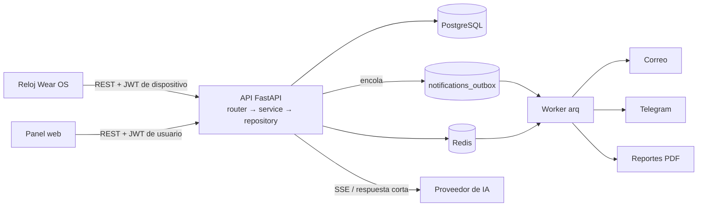

<div align="center">

# back-smartwatch

**API REST de recordatorios de medicamentos para un reloj Wear OS y un panel web.**


</div>

## Tabla de contenido

1. [Acerca del proyecto](#acerca-del-proyecto)
2. [Características principales](#características-principales)
3. [Stack tecnológico](#stack-tecnológico)
4. [Arquitectura y cómo funciona](#arquitectura-y-cómo-funciona)
5. [Relación con el frontend](#relación-con-el-frontend)
6. [Instalación y ejecución](#instalación-y-ejecución)
7. [Calidad y pruebas](#calidad-y-pruebas)
8. [Estructura de carpetas](#estructura-de-carpetas)
9. [Cómo contribuir](#cómo-contribuir)
10. [Licencia](#licencia)

## Acerca del proyecto

`back-smartwatch` es el backend de un sistema de recordatorios de medicamentos pensado para personas que necesitan tomar medicación a sus horas y para los cuidadores que las acompañan. El producto tiene dos clientes, ambos en el repositorio [`front-smartwatch`](https://github.com/StehvenObandoUcc/front-smartwatch):

- Un **reloj Wear OS independiente** (sin app de teléfono) que alarma a cada hora de toma y registra si la dosis fue tomada, pospuesta u omitida.
- Un **panel web** donde el paciente o su cuidador carga medicamentos y horarios, consulta la adherencia, descarga reportes y gestiona notificaciones.

La API centraliza cuentas, pacientes, medicamentos, el plan de dosis, el historial de tomas, las alertas (correo y Telegram), los reportes en PDF y un asistente conversacional con IA.

El contrato [`contracts/openapi.yaml`](contracts/openapi.yaml) es la fuente de verdad: de él se generan los clientes del frontend.

## Características principales

- **Cuentas y sesiones**: registro, inicio de sesión, refresh de token rotativo y revocable, verificación de correo y recuperación de contraseña. Roles paciente y cuidador.
- **Pacientes y cuidadores**: un cuidador gestiona pacientes mediante vínculos e invitaciones; solo ve los pacientes vinculados y activos.
- **Consentimientos** por finalidad que se comprueban antes de procesar datos.
- **Vinculación del reloj sin teclado** mediante un código corto (flujo tipo *device code*).
- **Medicamentos y horarios** con un plan de 7 días versionado y `ETag` (`304 Not Modified`) para el reloj.
- **Eventos de toma idempotentes** enviados por lotes, historial paginado por cursor y adherencia.
- **Notificaciones** por correo y Telegram mediante un patrón *outbox* entregado por un worker con reintentos.
- **Alertas** de dosis omitida y **reportes** semanales o bajo demanda, con PDF.
- **Chat con IA** con respuesta en streaming (SSE) para la web y respuesta corta para el reloj, con límite diario de mensajes.
- Errores en formato RFC 9457 (`application/problem+json`), rate limit en login, registro y chat.

## Stack tecnológico

| Capa | Tecnología | Versión |
| --- | --- | --- |
| Lenguaje | Python | 3.13 |
| Framework web | FastAPI + Uvicorn | ≥ 0.142.2 / ≥ 0.54.0 |
| Validación | Pydantic v2 + pydantic-settings | ≥ 2.13.5 / ≥ 2.15.0 |
| Base de datos | PostgreSQL (asyncpg) | 17 |
| ORM y migraciones | SQLAlchemy async + Alembic | ≥ 2.1.1 / ≥ 1.20.0 |
| Caché, rate limit y colas | Redis + arq (worker) | 7 / ≥ 0.28.0 |
| Seguridad | PyJWT + argon2-cffi | ≥ 2.15.1 / ≥ 25.1.0 |
| Reportes | fpdf2 | ≥ 2.8.3 |
| Cliente de IA | SDK `openai` (proveedor compatible) | ≥ 2.8.0 |
| Logging | structlog | ≥ 26.1.0 |
| Gestor de paquetes | uv | — |
| Calidad | ruff, mypy (strict), pytest, Testcontainers, Schemathesis | — |
| CI | GitHub Actions | — |

## Arquitectura y cómo funciona

El código se organiza por dominio en `app/modules/<dominio>/` con la cadena `router → service → repository`: los routers no tocan SQL y los servicios no conocen HTTP. Todo el I/O es asíncrono. Lo lento (correo, Telegram, PDF, alertas) nunca ocurre dentro de la petición: se encola en la tabla `notifications_outbox` o en una tarea y lo procesa el worker.



El worker ejecuta las tareas programadas: entrega del outbox (cada 15 s), alerta de dosis omitida (cada minuto), generación de reportes pendientes (cada 10 s) y creación del reporte semanal (cada hora; el lunes a las 08:00 locales de cada paciente). Si el worker está detenido, la API sigue funcionando y los avisos se acumulan.

### Flujo de punta a punta: registrar una toma

1. En el panel web, el cuidador crea un paciente, le carga un medicamento con su horario y vincula el reloj confirmando el código que este muestra.
2. El reloj descarga el plan con `GET /devices/me/plan` (usa `ETag`) y programa alarmas locales.
3. A la hora de la dosis, el paciente pulsa *Tomada*, *Posponer* u *Omitir*. El reloj guarda el evento con un `eventId` UUID y lo envía en lote a `POST /devices/me/dose-events`.
4. El backend valida que el horario sea del paciente del reloj y que `scheduledAt` sea un instante que ese horario genera, e inserta con `ON CONFLICT DO NOTHING`. Cada evento responde `created`, `duplicate` o `rejected`, por lo que reintentar es seguro.
5. El panel web consulta `GET /patients/{patientId}/dose-history` y `GET /patients/{patientId}/adherence`. Las dosis sin evento con más de 60 minutos de retraso se calculan como `MISSED` al consultar.

Las decisiones de diseño están documentadas en [`docs/adr/`](docs/adr).

## Relación con el frontend

Este repositorio se complementa con [**front-smartwatch**](https://github.com/StehvenObandoUcc/front-smartwatch), que contiene el reloj (`wear/`) y el panel web (`web/`).

| Aspecto | Detalle |
| --- | --- |
| Protocolo | REST sobre HTTP, JSON en `camelCase`, fechas ISO 8601 con zona, IDs UUID |
| Streaming | SSE en el chat de la web |
| Contrato | [`contracts/openapi.yaml`](contracts/openapi.yaml); el frontend genera sus clientes (Orval para la web, openapi-generator para el reloj) y fija el commit del contrato en su `contract.lock` |
| Autenticación web | JWT de acceso de 15 min en `Authorization: Bearer`; refresh token en cookie `httpOnly` (`/auth/refresh`) |
| Autenticación del reloj | Vinculación por código y token de dispositivo (`/devices/token`) |
| Errores | `application/problem+json` (RFC 9457) |
| Paginación | Cursor: `?cursor=&limit=` → `{ items, nextCursor }` |
| CORS | Solo el origen del panel web, con credenciales |

Endpoints principales:

| Área | Endpoints |
| --- | --- |
| Salud | `GET /health`, `GET /health/ready` |
| Auth | `POST /auth/register`, `/auth/login`, `/auth/refresh`, `/auth/logout`, `/auth/verify-email`, `/auth/forgot-password`, `/auth/reset-password` |
| Usuarios | `GET/PATCH /users/me`, `/users/me/consents`, `/users/me/notification-channels`, `/users/me/notification-preferences` |
| Pacientes | `GET/POST /patients`, `GET/PATCH /patients/{patientId}`, cuidadores e invitaciones |
| Reloj | `POST /devices/pairing-codes`, `POST /devices/pairing-codes/{code}/confirm`, `POST /devices/token`, `PUT /devices/me/push-token` |
| Medicamentos | `/patients/{patientId}/medications` y sus `/schedules` |
| Plan y tomas | `GET /devices/me/plan`, `GET /patients/{patientId}/plan`, `POST /devices/me/dose-events`, `GET /patients/{patientId}/dose-history`, `GET /patients/{patientId}/adherence` |
| Reportes | `/patients/{patientId}/reports` y `/reports/{reportId}/pdf` |
| Chat IA | `POST /patients/{patientId}/chat/messages` (web), `POST /devices/me/chat/messages` (reloj) |
| Telegram | `POST /telegram/webhook` |

La lista completa y los esquemas están en el contrato. Con `APP_ENV=local` la documentación interactiva queda disponible en `/docs`.

## Instalación y ejecución

### Requisitos

- [uv](https://docs.astral.sh/uv/) (instala Python 3.13 con `uv python install 3.13`)
- Docker (PostgreSQL y Redis de desarrollo y pruebas de integración)

### Pasos

1. Clona el repositorio y entra en la carpeta:

   ```sh
   git clone https://github.com/StehvenObandoUcc/back-smartwatch.git
   cd back-smartwatch
   ```

2. Crea tu propio archivo de entorno (`.env`) en la raíz del proyecto con la configuración que necesita la aplicación. Este README no documenta sus variables; consulta [`docs/claves-reales.md`](docs/claves-reales.md) para las claves de los servicios externos.

3. Levanta PostgreSQL (puerto `5433` del host) y Redis (puerto `6379`):

   ```sh
   docker compose up -d --wait
   ```

4. Instala las dependencias y aplica las migraciones:

   ```sh
   uv sync
   uv run python -m alembic upgrade head
   ```

5. Arranca la API:

   ```sh
   uv run python -m uvicorn app.main:create_app --factory --reload
   ```

   Para que el emulador del reloj o un teléfono alcancen la API, arráncala con `--host 0.0.0.0`.

6. Comprueba que responde: `GET http://localhost:8000/health` y `GET http://localhost:8000/health/ready`.

7. (Opcional) Arranca el worker en otra terminal para correo, alertas y reportes:

   ```sh
   PYTHONUTF8=1 uv run python -m arq app.worker.main.WorkerSettings
   ```

   `PYTHONUTF8=1` evita errores de codificación en la consola de Windows.

8. Al terminar: `docker compose stop`.

### Telegram

Para un bot real hace falta un bot de @BotFather y una URL HTTPS pública. El script registra el webhook:

```sh
bash scripts/telegram-webhook.sh set https://tu-dominio.com
bash scripts/telegram-webhook.sh info
```

### Verificación de punta a punta

Con la API levantada (Git Bash, `curl` y `python` en el PATH):

```sh
bash scripts/verify-sprint-a.sh   # cuentas, paciente, medicamento, vinculación, plan, tomas, adherencia
bash scripts/verify-sprint-b.sh   # correo/outbox, Telegram, alertas, reportes y chat
```

Cada paso imprime `OK` o `FALLÓ`, y el script termina con código distinto de cero si algo falla.

## Calidad y pruebas

Antes de hacer push:

```sh
uv run ruff check .
uv run ruff format --check .
uv run mypy
uv run pytest               # unitarias + integración (requiere Docker)
uv run pytest tests/unit    # solo unitarias, sin Docker
```

En Windows, si el lanzador de `uv run` falla, usa `uv run python -m mypy` y `uv run python -m pytest`. La CI (GitHub Actions) ejecuta estas comprobaciones y verifica que no haya migraciones pendientes.

## Estructura de carpetas

```
back-smartwatch/
├── app/
│   ├── core/            Config, logging, errores problem+json, DB, middleware, auth, rate limit
│   ├── modules/         Un paquete por dominio (router → service → repository)
│   │   ├── auth/            Registro, login, refresh, verificación y recuperación
│   │   ├── users/           Perfil del usuario
│   │   ├── patients/        Pacientes, cuidadores e invitaciones
│   │   ├── consents/        Consentimientos por finalidad
│   │   ├── devices/         Vinculación y sesión del reloj
│   │   ├── medications/     Medicamentos y horarios
│   │   ├── plan/            Generación del plan de dosis con ETag
│   │   ├── doses/           Eventos de toma, historial y adherencia
│   │   ├── notifications/   Outbox, plantillas, canales (correo, Telegram) y alertas
│   │   ├── reports/         Reportes y PDF
│   │   ├── chat/            Chat con IA
│   │   └── health/          Liveness y readiness
│   ├── worker/          Worker arq (tareas programadas)
│   └── main.py          create_app()
├── migrations/          Migraciones Alembic (async)
├── contracts/           openapi.yaml (fuente de verdad)
├── docs/                ADR (docs/adr), planes de desarrollo y guía de claves
├── scripts/             Verificación de sprints y registro del webhook de Telegram
├── tests/               unit/ e integration/ (Testcontainers + Schemathesis)
├── docker-compose.yml   PostgreSQL y Redis de desarrollo
└── pyproject.toml       Dependencias y configuración de ruff, mypy y pytest
```

## Cómo contribuir

1. Haz un fork o crea una rama desde `main` (`feat/api-<tema>`, `docs/<tema>`).
2. Si el cambio toca la API, empieza por modificar [`contracts/openapi.yaml`](contracts/openapi.yaml): nunca introduzcas cambios incompatibles en endpoints publicados.
3. Respeta la arquitectura `router → service → repository` y añade pruebas (autorización, idempotencia y adherencia son obligatorias cuando aplican).
4. Ejecuta las comprobaciones de [Calidad y pruebas](#calidad-y-pruebas).
5. Usa commits convencionales (`feat:`, `fix:`, `docs:`...) y abre un Pull Request pequeño que explique qué cambia, cómo se probó y qué endpoints cubre.
6. Las decisiones de diseño relevantes se documentan en una ADR en `docs/adr/NNNN-titulo.md`.

No incluyas secretos, tokens ni datos de salud en el código, los logs o los PR.

## Licencia

Por confirmar. El repositorio no incluye un archivo de licencia.
